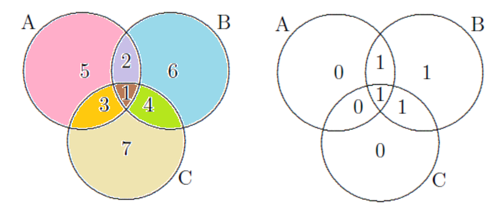

# Introduction (with ChatGPT)
Error correction codes (ECC) are techniques used in digital communication and data storage to detect and correct errors that occur during transmission or storage. These errors can be caused by various factors such as noise, interference, or physical defects in the medium.  

One of famous ECC is Hamming code, used in digital communication and data storage systems. Named after its inventor, Richard Hamming, it adds extra parity bits to transmitted data, enabling the detection and correction of errors that occur during transmission or storage. By assigning parity bits to cover specific combinations of data bits, Hamming code can identify and correct single-bit errors and detect some multiple-bit errors. 

For example, the Hamming (7, 4) code uses 7 bits to encode a 4 bit message.  We can use the set method to illustate the idea.  As shown in the following figure, $A$, $B$, and $C$ are three intersecting sets.  The original message are placed in the area 1 to area 4.  Next, we add bits to area 5 to 7, so that each circle has even number of 1s. For example: the original message 1011.  The filled in data is $b_5=0, b_6 = 1, b_7 = 0$.  So the final code is 1011010.
  

When receving the code 1111010, we know something wrong, because in circle A and in circle C, the total numbers of 1s are not even.   Moreover, we also know that the error must be in the intersection of circle A and circle C, but not in the circle B.  So if there is only one bit needed to be correct, that is bit 3, from 1 to 0.  

# 0-1 Vector space
In this project, we will learn how to use 0-1 vector space to design Hamming code (7, 4).

A 0-1 vector space is a specific type of vector space where the vectors consist of elements that are either 0 or 1. In other words, each component of the vectors can take only one of two possible values: 0 or 1.

Formally, a 0-1 vector space can be defined as follows:

Let F be a field, typically $F = \{ 0, 1 \}$ with addition and multiplication modulo 2 (also known as the binary field).
For addition, the definition is 
| + | 0 | 1 |
|---|---|---|
| 0 | 0 | 1 |
| 1 | 1 | 0 |

For multiplication, the definition is 
| * | 0 | 1 |
|---|---|---|
| 0 | 0 | 0 |
| 1 | 0 | 1 |

For a message with $n$ bits, we can make it a $n$-vector of elements in $F$.  For example, when $n=4$, a message  $1011$ can be formulate as 

$$ m=\begin{bmatrix} 1 \\ 
                     0 \\ 
                     1 \\ 
                     1 \end{bmatrix}. $$

We can call such vector space $F^4$ and define vector addition and scalar multiplication as follows.
- Vector addition: If $v$ and $w$ are in $F^4$, $v+w$ is defined as

$$ v+w=\begin{bmatrix}
            v_1+w_1\\
             v_2+w_2\\
             v_3+w_3 \\
             v_4+w_4
  \end{bmatrix} $$
  
  where $v_i$ and $w_i$ are the elements of $v$ and $w$ respectively.
- Scalar multiplication: For $v\in F^4$ and $\alpha\in F$, 

$$ \alpha v=\begin{bmatrix} \alpha v_1 \\
                               \alpha v_2 \\
                               \alpha v_3 \\
                               \alpha v_4
  \end{bmatrix} $$

# Assignment
1. (10%) Let matrix $A$ be

$$ A =\begin{bmatrix}
       1 & 0 & 0 & 0 \\
       0 & 1 & 0 & 1 \\
       0 & 0 & 1 & 0 \\
       0 & 0 & 0 & 1 \\
       1 & 1 & 1 & 0 \\
       1 & 1 & 0 & 1 \\
       1 & 0 & 1 & 1
   \end{bmatrix},$$

  For $x = [1 \ 1 \ 0 \ 1]^T$, show that $Ax = [1 \ 1 \ 0 \ 1 \  0 \  1 \ 0 \ 1]^T$.

2. (20%) For $x \in F^4$, show that $y = Ax$ is the same as the encoded result using the set method.

3. (10%) Find the null space of $A$.
   
4. (20%) Suppose the null space of $A$ is span($h_1, h_2, \ldots, h_k$) and let matrix $H=[h_1, h_2, \ldots, h_k]$.  Show that the encoded message $y$ does not have any error if and only if $Hy = 0$.

5. 
 
   

