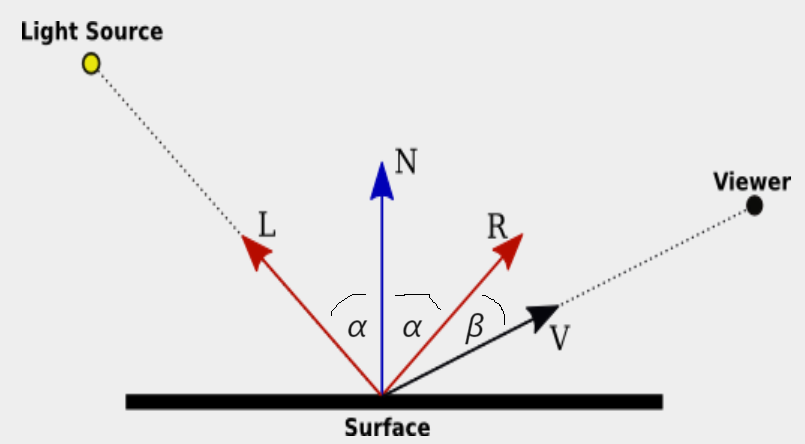

# Introduction 
Flat shading is a basic technique used in computer graphics to render three-dimensional objects. In flat shading, each polygon of an object is rendered with a single color, typically based on the color of its surface. This means that all points on a polygon receive the same color, regardless of their position relative to the light source or other factors. While simple and computationally efficient, flat shading can produce a faceted appearance, especially on curved surfaces, due to the lack of shading gradients across the polygons. (ChatGPt)

  
  

There are two commonly used light effect to determine the color of a polygon.  The first one is the ambient light (natural light), which is directionless and everywhere.  An object of the same color with ambient light only has the one color for every polygon, as the image shown on the left. The second one is called the diffusion light, by which different polygons have different color intensity based on where the light source is.  An example of diffusion lighting is shown on the right image above.

  

The intensity of the diffusion light is determined by several factors, including light source, surface normal, and viewer's position.  As shown in the above figure, which is retrieved from https://math.hws.edu/graphicsbook/c7/s2.html, vector *N* is the surface normal; vector *V* is where the position of the viewer; vector *L* is the light source, and vector *R* is the reflection of the light.  The law of reflection says that the angle between *L* and *N*, $\alpha$, is the same the angle btween *R* and *N*, and they are on the same plane.  Moreover, the intensity of the diffusion light is proportional to the cosine of the angle between *R* and *V*, $\cos(\beta)$.

In this project, we will learn how to compute the flat shading of a given object.  The object we used is from https://github.com/nopjia/tracer/blob/master/data/icosahedron.obj, which is an .obj file.  A obj file gives the 3D coordinates of vertices and records the faces with the bounding vertices in order.  Above animation shows how the intensity of faces change when the light source is moving around the icosahedron.

# Assignments
1. (15 %) Complete the function **compute_lookat(azim, elev)**, which computes the viewer's direction $V$.  Originally, the viewer is looking at from the direction $[x, y, z] = [1, 0, 0]$.  But when the plot is shown, the viewer's direction will be changed.  How the position changes is characterized by two variables: azimuth and elevation, whose definition can be found here https://matplotlib.org/stable/api/toolkits/mplot3d/view_angles.html.  Please normalize the vector $V$ when return it.
2. (15 %) Complete the function **compute_normal(P1, P2, P3)**, which computes the surface normal $N$ of each face from three vertices $P1, P2, P3$.
3. (15 %) Complete the function **visible(face_normal, lookat)**, which determines whether a face is visible from the viewer's direction.  The argument face_normal is $N$ and lookat is $V$.
4. (15 %) Complete the function **compute_intensity(face_normal, lookat, lightsource)**, which calculates the intensity of the diffusion lighting.
5. (20 %) Perform at least two tasks from the following list, and describe what you have done.
    1. Change a model.
    2. Give each face of the model a different color.
    3. Change the movemnt of the light source.
    4. Othere interesting changes
6. (20 %) There is a type of terms, called **vn** (vertex normal), in the obj file.  Answer the following questions.
   1. How to compute the vertex normal?  Use an example in the icosahedron.obj to illustate the algorithm.
   2. What are the applications of vertex normal?  Give at least one application with examples.  Cite the sourc properly.  
