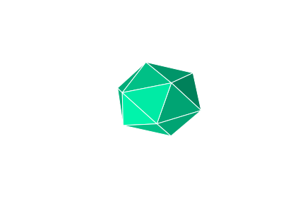

# Introduction 
Flat shading is a basic technique used in computer graphics to render three-dimensional objects. In flat shading, each polygon of an object is rendered with a single color, typically based on the color of its surface. This means that all points on a polygon receive the same color, regardless of their position relative to the light source or other factors. While simple and computationally efficient, flat shading can produce a faceted appearance, especially on curved surfaces, due to the lack of shading gradients across the polygons. (ChatGPt)

  
  

There are two commonly used light effect to determine the color of a polygon.  The first one is the ambient light (natural light), which is directionless and everywhere.  An object of the same color with ambient light only has the one color for every polygon, as the image shown on the left. The second one is called the diffusion light, by which different polygons have different color intensity based on where the light source is.  An example of diffusion lighting is shown on the right image above.

  

The intensity of the diffusion light is determined by several factors, including light source, surface normal, and viewer's position.  As shown in the above figure, which is retrieved from https://math.hws.edu/graphicsbook/c7/s2.html, vector *N* is the surface normal; vector *V* is where the position of the viewer; vector *L* is the light source, and vector *R* is the reflection of the light.  The law of reflection says that the angle between *L* and *N*, $\alpha$, is the same the angle btween *R* and *N*, and they are on the same plane.  Moreover, the intensity of the diffusion light is proportional to the cosine of the angle between *R* and *V*, $\cos(\beta)$.

In this project, we will learn how to compute the flat shading of a given object.  The object we used is from https://github.com/nopjia/tracer/blob/master/data/icosahedron.obj, which is an .obj file.  From the 
