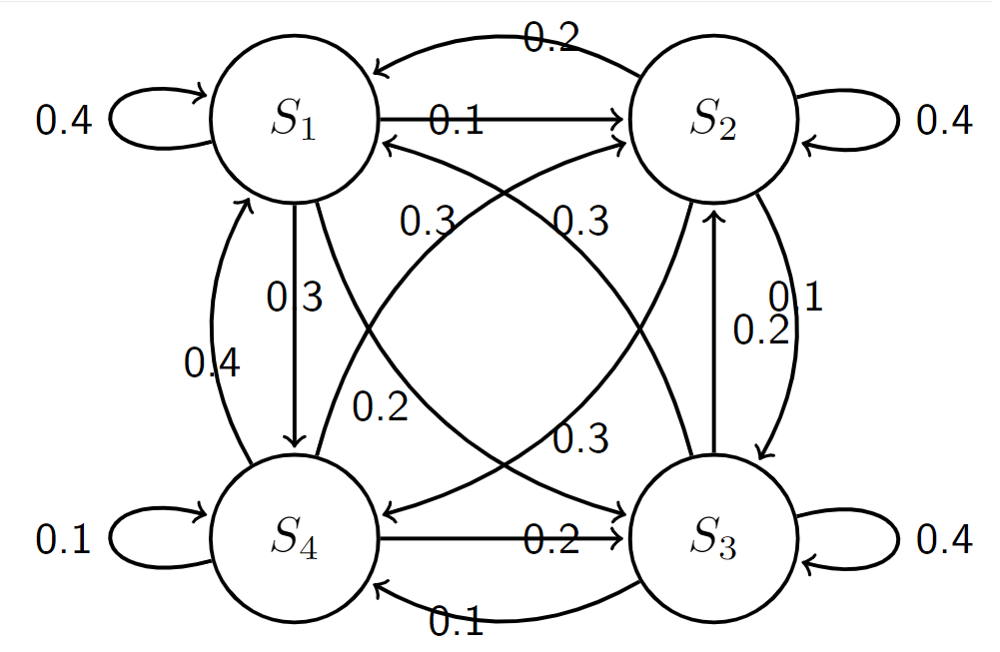

# Introduction
Generative AI refers to a class of artificial intelligence systems designed to generate new content or data that is original and resembles human-created output in some way. Unlike traditional AI systems, which are typically task-specific and focused on solving particular problems, generative AI models have the ability to create new content across a variety of domains, including text, images, music, and more.

In this assignment, we will learn how to use Markov chains to generate text sequences. A Markov chain is a stochastic model that describes a sequence of possible events in which the probability of each event depends only on the state attained in the previous event. In other words, it is a memoryless random process.

Formally, a Markov chain is defined by the following components:

- **States**: A set of possible states that the system can be in.
- **Transition Probabilities**: The probabilities of moving from one state to another.
- **Initial State Distribution**: The probabilities of starting in each state.

# Example: 4-node Markov Chain
Consider a simple example of a 4-node Markov chain, where each node represents a different state and the transition probabilities are represented by the edges between nodes. Let's denote the states as $S_1, S_2, S_3,$ and $S_4$. The transition matrix $P$ can be represented as:

$$
P = \begin{pmatrix}
0.4 & 0.1 & 0.2 & 0.3 \\
0.2 & 0.4 & 0.1 & 0.3 \\
0.3 & 0.2 & 0.4 & 0.1 \\
0.4 & 0.3 & 0.2 & 0.1 \\
\end{pmatrix}
$$

where $P_{ij}$ represents the probability of transitioning from state $S_i$ to state $S_j$.  The pictorial presentation is shown below.

This represents a Markov chain where each state has transitions to every other state, including itself. The probabilities of transitioning between states are indicated by the labels on the edges.
